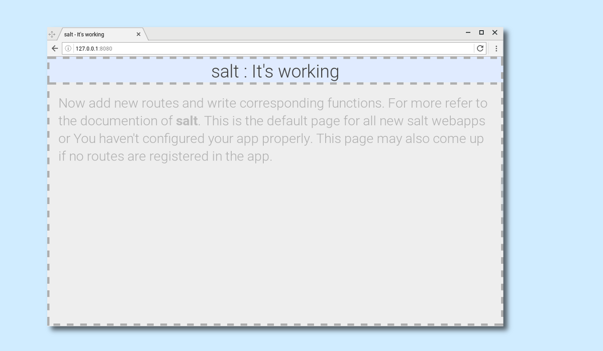

# salt : yet another tasty {M}VC for golang

## Intro
Salt is a go package to improve routing upon the standard http package. It has inbuilt mechanisms to maintain models and connect to databases(only MySQL for now).

## Quickstart
This repo contains a salt cmd tool.
```shell
salt create [appname]
```

### App structure
It creates a folder of the same name with a sample app contained in it.
The general folder stucture will be like : (Sample App name : sampleapp)

```
--- sampleapp/
          |------- app.json
          |------- sampleapp.go
     	  |------- sampleapp/
                        |------- app.go
                        |------- models.go
                        |------- urls.go
                        |------- views.go
          |------- static/

```

#### app.json
The file app.json is the app configuration for the web application.

```json
{
    "Debug" : true,
    "ListenVars" : {
        "Port" : "8080",
        "Address": "127.0.0.1"
    },
    "Static" : {
        "StaticURI" : "/static/",
        "StaticDirs" : ["static/"]
    },
    "Database" : {
        "Username" : ${Username},
        "Password" : ${Password},
        "Database" : ${Database}
    }
}
```

The json fields are self explainatory.
Now change the variables accordingly for you set-up. Be sure to change the Database connection settings.

#### sampleapp.go or [appname].go
This is the entry point of the binary. ie., This is the "main" package or conatins the main function.
Root app and other apps are added and managed through this entry point.

#### sampleapp/
This is the directory that contains the root app's contents. The name of the root app can be changed by changing the
package name in the go files in the directory and the bettr the directory itself. The app can be reconfigured after
renaming from the [appname].go

#### app.go
This is the app setting file or the app configuration file. Name of the app, Models, URL routing patterns and Base
URL can be specified in this file.

#### models.go
This contains the models. These models get automatically migrated when the app is being run. Yet there is an issue
that if the model description change for a particular table, migration of database to the new table configuration
is not implemented.
Before running the app please be sure to form the models or clear all the models (if not using). This may affect
your mysql database.

#### urls.go
Simple. This contains the urls routing patterns. salt has been written so that URL regexp matching is done during runtime.
So salt is not only limited to1 static URL routing (as in net/http)

#### views.go
This contains the functions that generates the views for the specified URL Patterns. Add a new view and a url routing
before running the new app or remove the import statement in this file.

### Run the app
To run it either
```shell
salt run [appname]
```
or
```shell
go run [appname].go
```
inside that folder.

You can see the home page like this:


Documentation is under process. For now refer to the godoc page. For further issues, well, use the github issue utility to file any.
